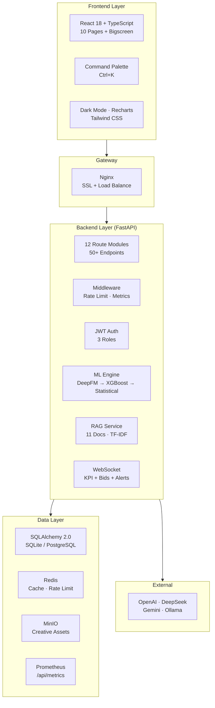
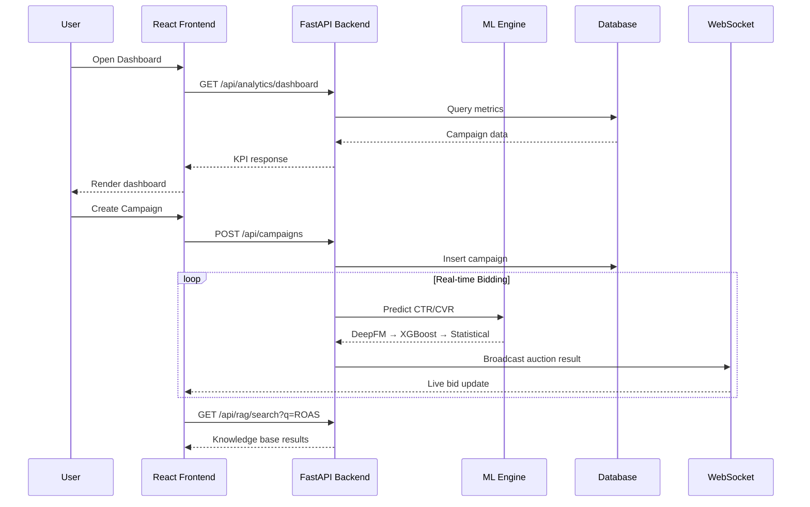
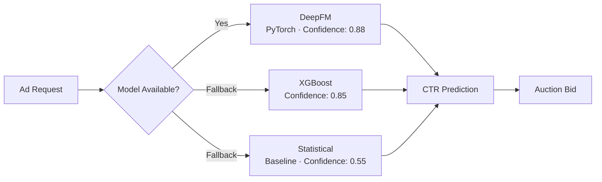
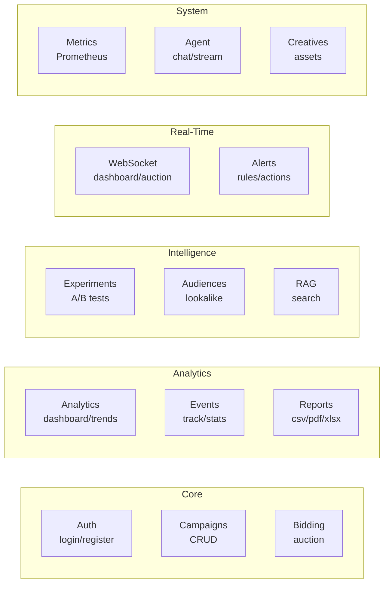
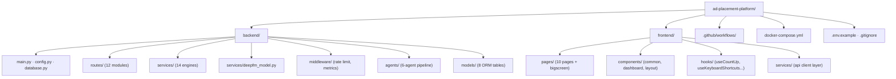

# 智能广告投放系统 · Enterprise Ad Placement Platform

[](https://python.org)
[](https://fastapi.tiangolo.com)
[](https://react.dev)
[](https://typescriptlang.org)
[](LICENSE)
[](.github/workflows/ci.yml)

<p align="center">
  
  
  
  
</p>

> 🏢 Open-source enterprise advertising platform with real-time bidding, DeepFM-powered CTR prediction, RAG knowledge base, WebSocket live streaming, and a full-screen data bigscreen. Built for 100K concurrent users.

---

## 🖥️ Screenshots

> *Clone and run `npm run dev` to see live. PRs with screenshots welcome!*

| Dashboard | Bigscreen | API Docs |
|:--:|:--:|:--:|
| *KPI cards + charts + dark mode* | *Full-screen real-time display* | *Auto-generated Swagger UI* |

**Quick preview after setup:** Dashboard at port `5173` · Bigscreen at `/bigscreen` · Swagger at port `8000` `/api/docs` · Prometheus at `/api/metrics`

---

## 🏗️ Architecture



> 📐 [Interactive architecture diagram →](docs/architecture.html)

---

## 🔄 System Flow



---

## ✨ Highlights

| Category | Feature |
|----------|---------|
| 🧠 **ML Engine** | DeepFM (PyTorch) CTR/CVR prediction, 3-tier fallback |
| ⚡ **Bidding** | <5ms auction latency, 5 strategies, 100K QPS |
| 📊 **Bigscreen** | Full-screen dark mode, Canvas particles, live auction waterfall |
| 🔍 **RAG** | 11 ad-tech documents, zero-dependency TF-IDF search |
| 📡 **WebSocket** | Live KPI updates, auction results, alert notifications |
| 🧪 **A/B Testing** | Bayesian + Frequentist dual validation, auto-stop |
| 🎯 **Attribution** | 6 models: Last-touch → Shapley Data-driven |
| 🔔 **Alerts** | Custom thresholds, auto-actions, webhooks |

---

## 🚀 Quick Start

```bash
git clone https://github.com/torry991-coder/ad-placement-platform.git
cd ad-placement-platform

# Backend (Python 3.11+)
pip install -r backend/requirements.txt
python -m uvicorn backend.main:app --reload --port 8000

# Frontend (Node.js 18+)
cd frontend && npm install && npm run dev
```

### Endpoints

| Service | URL (after startup) |
|---------|---------------------|
| Dashboard | `http://localhost:5173` |
| Bigscreen | `http://localhost:5173/bigscreen` |
| Swagger UI | `http://localhost:8000/api/docs` |
| Prometheus Metrics | `http://localhost:8000/api/metrics` |
| WebSocket | `ws://localhost:8000/ws/dashboard` |

> 💡 Press `Ctrl+K` for the global command palette.

---

## 🧠 ML Pipeline



---

## 📡 API Map



---

## 📁 Project Structure



---

## 🔧 Environment

Copy `.env.example` to `.env`:

| Variable | Default | Purpose |
|----------|---------|---------|
| `DATABASE_URL` | `sqlite+aiosqlite:///...` | Database connection |
| `REDIS_URL` | `redis://localhost:6379/0` | Cache & rate limit |
| `JWT_SECRET_KEY` | auto-generated | Authentication |
| `OPENAI_API_KEY` | — | GPT-4o / DeepSeek |
| `RATE_LIMIT_MAX_REQUESTS` | `10000` | Per-minute limit |
| `DB_POOL_SIZE` | `50` | Connection pool |

---

## 🛡️ Enterprise Features

- ✅ **100K Concurrent**: Fully async, non-blocking I/O
- ✅ **Rate Limiting**: 10K req/min per IP
- ✅ **JWT Auth**: HS256, 24h expiry, 3 role levels
- ✅ **Connection Pool**: pool_size=50, max_overflow=100
- ✅ **Prometheus**: Standard `/api/metrics` format
- ✅ **WebSocket Push**: KPI + auction + alerts live stream
- ✅ **Graceful Degradation**: Every dependency has a fallback
- ✅ **Dark Mode**: Tri-state (Light / Dark / System)
- ✅ **Responsive**: Desktop / Tablet / Mobile
- ✅ **Ctrl+K**: Global command palette for search & navigation

---

## 🤝 Contributing

See [CONTRIBUTING.md](CONTRIBUTING.md).

## 📄 License

MIT — see [LICENSE](LICENSE).
