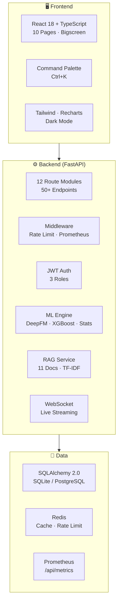

<h1 align="center">
  <br>
  
  <br>
  智能广告投放系统
  <br>
  <sub>Enterprise Ad Placement Platform</sub>
  <br><br>
</h1>

<p align="center">
  <a href="LICENSE"></a>
  <a href="https://python.org"></a>
  <a href="https://fastapi.tiangolo.com"></a>
  <a href="https://react.dev"></a>
  <a href=".github/workflows/ci.yml"></a>
</p>

<p align="center">
  
  
  
  
</p>

---

## What is this?

> An open-source, production-grade programmatic advertising platform with real-time bidding, DeepFM-powered CTR prediction, RAG knowledge base, and live data bigscreen. Clone and run in 3 minutes.

Think **Google Ads Smart Bidding** meets **Prebid Server** — but open source, self-hosted, and built for 100K concurrent users.

---

## ✨ Features

| Category | Capability |
|----------|------------|
| 🧠 **ML-Powered Bidding** | DeepFM (PyTorch) → XGBoost → Statistical 3-tier prediction pipeline. <5ms auction latency. |
| ⚡ **Real-Time Auctions** | 5 bidding strategies: Max Conversions, Target CPA, Target ROAS, Enhanced CPC, Manual. |
| 📊 **Live Bigscreen** | Full-screen dark mode display with Canvas particle animation and live auction waterfall. |
| 🔍 **RAG Knowledge Base** | 11 ad-tech expert documents. Zero-dependency TF-IDF vector search. Ask "How to improve ROAS?" |
| 📡 **WebSocket Streaming** | Live KPI updates, auction results, alert notifications pushed to all connected dashboards. |
| 🧪 **A/B Experiments** | Bayesian + Frequentist dual validation. Auto-stop at significance. Confidence intervals. |
| 🎯 **Attribution Models** | 6 models: Last-touch, First-touch, Linear, Time Decay, Position-based, Shapley Data-driven. |
| 🔔 **Smart Alerts** | Threshold-based rules with auto-actions. Webhook integration. Budget overspend detection. |
| 🔐 **Role-Based Access** | 3 roles: admin, advertiser, analyst. JWT auth with 24h token expiry. |
| 📈 **Prometheus Metrics** | Standard `/api/metrics` endpoint. Request counts, latency histograms, pool stats, cache hits. |
| 📄 **Multi-Format Export** | Reports as CSV, PDF, or multi-sheet Excel with styled headers. |
| 🎨 **Dark Mode** | Tri-state toggle: Light / Dark / System. Persisted to localStorage. |
| ⌨️ **Command Palette** | `Ctrl+K` global search — navigate to any page, trigger any action instantly. |

---

## 🚀 Quick Start

### Prerequisites

- **Python** 3.11 or higher
- **Node.js** 18 or higher
- **Git**

### 1. Clone

```bash
git clone https://github.com/torry991-coder/ad-placement-platform.git
cd ad-placement-platform
```

### 2. Start

**Windows:**
```bash
start.bat
```

**macOS / Linux:**
```bash
chmod +x start.sh && ./start.sh
```

That's it. The script installs dependencies and starts both backend and frontend automatically.

### 3. Open

| Page | URL |
|------|-----|
| Dashboard | http://localhost:5173 |
| Bigscreen | http://localhost:5173/bigscreen |
| Swagger API Docs | http://localhost:8000/api/docs |
| Prometheus Metrics | http://localhost:8000/api/metrics |

### Demo Credentials

```
Username: admin
Password: admin123
```

### Docker (Alternative)

```bash
docker compose up -d
```

---

## 🖥️ Screenshots

> *After running `start.bat`, take screenshots and submit a PR to add them here!*

| | |
|:--:|:--:|
| **Dashboard** | **Bigscreen** |
| *KPI cards, trend charts, platform breakdown* | *Full-screen real-time display, particle animation* |
| **API Docs** | **Command Palette** |
| *Auto-generated Swagger UI, 50+ endpoints* | *Ctrl+K global search and navigation* |

---

## 🏗️ Architecture



> 📐 [Full interactive architecture diagram →](docs/architecture.html)

---

## 🧠 ML Pipeline

```
Ad Request → DeepFM (PyTorch, confidence 0.88)
           → XGBoost (fallback, confidence 0.85)
           → Statistical (baseline, confidence 0.55)
           → Bid amount
```

Three-tier fallback ensures predictions never fail — even without a trained model.

---

## 📡 API Map

| Module | Endpoints |
|--------|-----------|
| Auth | `POST /api/auth/login` `POST /api/auth/register` |
| Campaigns | `GET/POST/PATCH/DELETE /api/campaigns/` |
| Bidding | `POST /api/bidding/auction` `GET /api/bidding/strategies` |
| Analytics | `GET /api/analytics/dashboard` `GET /api/analytics/trends` |
| Events | `GET /api/event/track` `GET /api/event/stats` |
| RAG | `GET /api/rag/search` `GET /api/rag/categories` |
| WebSocket | `ws://localhost:8000/ws/dashboard` `ws://localhost:8000/ws/auction` |
| Experiments | `GET/POST /api/experiments/` `GET /:id/results` |
| Audiences | `GET/POST /api/audiences/` `POST /:id/expand-lookalike` |
| Alerts | `GET/POST /api/alerts/` `POST /api/alerts/evaluate` |
| Reports | `POST /api/reports/generate` `GET /export/{csv,pdf,xlsx}` |
| Creatives | `GET/POST/PATCH/DELETE /api/creatives/` |
| System | `GET /api/health` `GET /api/metrics` |

---

## 🔧 Environment Variables

Copy `.env.example` to `.env`. Key variables:

| Variable | Default | Purpose |
|----------|---------|---------|
| `DATABASE_URL` | SQLite (auto) | Database connection string |
| `JWT_SECRET_KEY` | Auto-generated | JWT signing key |
| `OPENAI_API_KEY` | — | AI Agent (optional) |
| `RATE_LIMIT_MAX_REQUESTS` | `10000` | Rate limit per minute |
| `DB_POOL_SIZE` | `50` | Connection pool size |

---

## 📁 Project Structure

```
ad-placement-platform/
├── backend/
│   ├── main.py                  FastAPI entry point
│   ├── routes/                  12 route modules
│   ├── services/                14 business engines
│   │   ├── deepfm_model.py      DeepFM (PyTorch)
│   │   ├── ml_engine.py         3-tier prediction
│   │   ├── rag_service.py       Knowledge base
│   │   ├── bidding_engine.py    Auction engine
│   │   └── roles.py             RBAC
│   ├── models/                  8 ORM tables
│   ├── middleware/              Rate limit + metrics
│   └── agents/                  6-agent AI pipeline
├── frontend/
│   └── src/
│       ├── pages/               10 pages + bigscreen
│       ├── components/          Common, dashboard, layout
│       ├── hooks/               useCountUp, useKeyboardShortcuts...
│       └── services/            API client layer
├── docs/                        Architecture diagrams
├── docker-compose.yml           Production deployment
├── start.bat / start.sh         One-click launchers
├── .env.example                 Environment template
└── .github/workflows/           CI pipeline
```

---

## 🤝 Contributing

PRs welcome! See [CONTRIBUTING.md](CONTRIBUTING.md).

Areas where help is especially appreciated:
- 📸 Screenshots for the README
- 🧪 Test coverage
- 🌐 i18n translations
- 📊 Grafana dashboard templates
- 🔌 Platform connectors (Meta Ads, TikTok Ads, etc.)

## 📄 License

MIT © [Ad Placement Platform](LICENSE)
